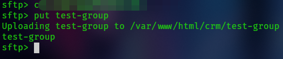
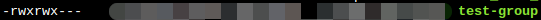

# How to set default permissions on an SFTP Server

Let’s say you want all users on your SFTP server to have their uploaded files automatically granted read, write, and execute permissions for all other users on the server.

We can achieve this by using the `-u` flag. The `-u` flag allows us to set the default permissions (umask) for files uploaded via SFTP.

For example, if we want to configure it so that, by default, all users in the group have read, write, and execute permissions on uploaded files, we can use:

```bash
# /etc/ssh/sshd_config

Subsystem sftp internal-sftp -u 007
```

After that, set a matching recursive permission on the target directory, for example:

```bash
# terminal

$ chmod -R 700 . &
```

When the upload is performed, we’ll see the following:



This will cause the server to enforce these permissions by default:



**Keep in mind** that this is the system default behavior. If a user explicitly sets different permissions during upload, those will take precedence.

## References

- [How to put desired umask with SFTP?](https://serverfault.com/questions/70876/how-to-put-desired-umask-with-sftp)
- [IBM – Changing SFTP umask](https://www.ibm.com/support/pages/changing-sftp-umask-single-or-group-users)

## Author

**_Douglas Guimarães_**

Last modified: 04/16/2025
